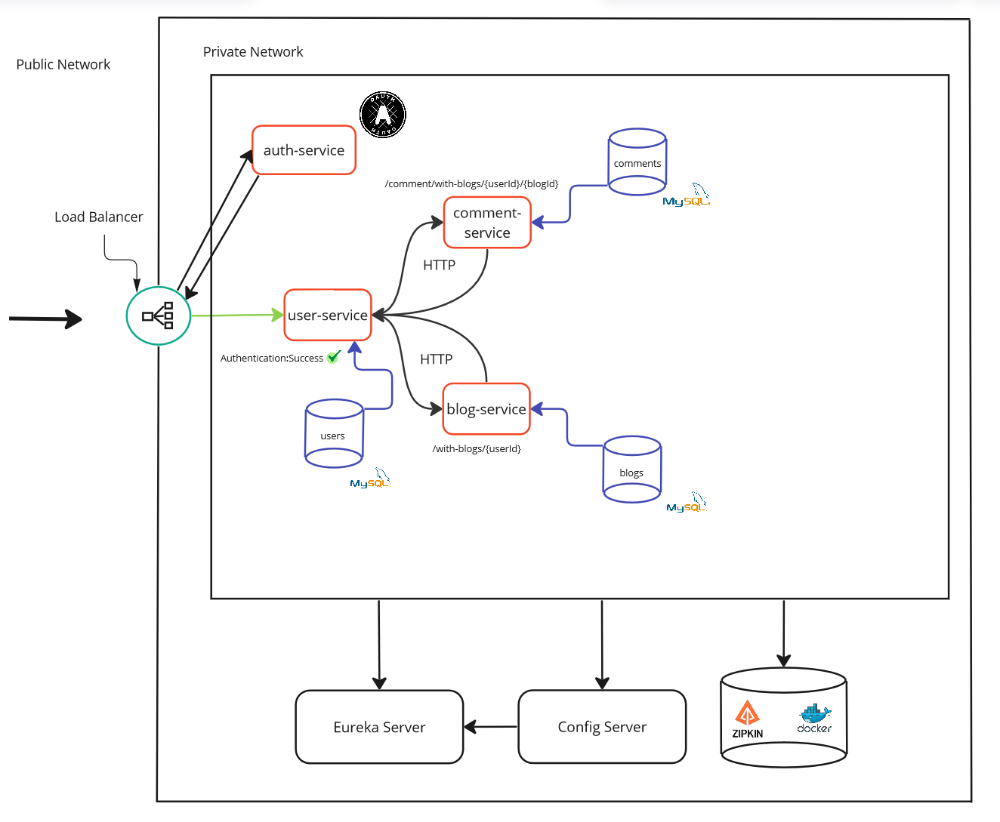
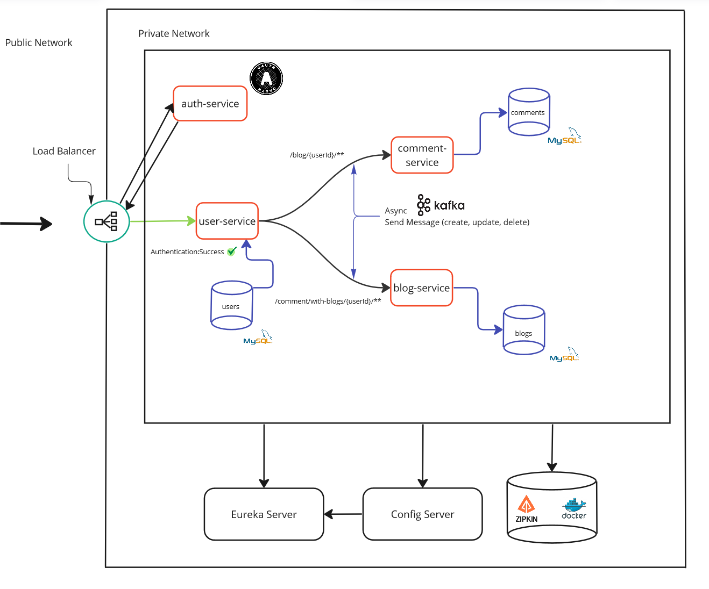

# MyBlog
MyBlog проект на микросервисной архитектуре

## Содержание
- [Технологии](#технологии)
- [Разработка](#разработка)

## Технологии
- [Java](https://www.java.com/ru/)
- [Spring](https://spring.io/)
- [Apache Kafka](https://kafka.apache.org/)
- [Apache Zookeeper](https://zookeeper.apache.org/)
- [Spring Security](https://spring.io/projects/spring-security)
- [OAuth 2.0](https://oauth.net/2/)
- [Zipkin](https://zipkin.io/)
- [Docker](https://www.docker.com/)
- [MySql](https://www.mysql.com/)
- [Spring Data JPA](https://spring.io/projects/spring-data-jpa)
- [Thymeleaf](https://www.thymeleaf.org/)
- [Eureka](https://spring.io/guides/gs/service-registration-and-discovery/)

## Разработка
Этот проект представляет собой платформу для создания собственного блога, где пользователи могут 
отслеживать события в жизни других пользователей и взаимодействовать, оставляя комментарии под их записями.

#### Так как этот проект на микросервисной архитектуре, то он включает в себя следующие сервисы:
1) config-service:
   - Сервис, в котором находятся все конфигурации каждого сервиса.
2) service-registry:
   - > Eureka Server — это service discovery (обнаружение сервисов) для ваших микросервисов. Клиентские приложения могут самостоятельно регистрироваться в нем, а другие микросервисы могут обращаться к Eureka Server для поиска необходимых им микросервисов.
   - Проще, этот сервис является грубо говоря контейнером, в котором лежат все сервисы, каждый сервис регистрируется в нём.
3) authorization-service:
   - Сервис отвечающий за регистрацию и авторизацию пользователей, чтобы не получилось такого, что неавторизованный пользователь мог манипулировать с вашими данными, например удалять блоги, читать комментарии.
   - Основан на OAuth 2.0, при аутентификации вы получаете jwt, который будет гарантировать, что вы это вы.
4) api-gateway:
   - Вокруг него построена вся архитектура, он получает все запросы от клиентов, обрабатывает и рассылает разным сервисам.
5) user-service:
   - Сервис отвечающий за пользователей, пользователи с помощью данного сервиса получают всю необходимую информацию, именно он делает запросы на сервисы blog-service и comment-service.
6) blog-service:
   - Данный сервис отвечает за информацию о блогах, предоставляет их, удаляет или редактирует. 
7) comment-service:
   - Сервис comment-service отвечает за комментарии, по аналогии с blog-service, можно получать информацию, удалять её или редактировать.

### Под капотом этот проект представляет, из себя следующее:
#### Получение, каких-либо данный происходит синхронно:

#### Публикации и манипуляции с блогами и комментариями происходят ассинхронно:

### Зачем вы разработали этот проект?
Хотелось углубиться в микросервисную архитектуру.

